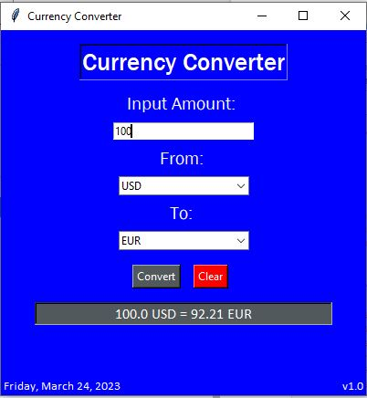

# Currency-converter
Python can be used to develop this simple graphical user interface (GUI) application. This project is about building a currency converter that will allow you to convert currencies from one unit to another, such as converting USD into XOF or EUR.

The application design will be straightforward, focusing on the primary function, which is converting units. With Tkinter, the Tk GUI toolkit can be used.

# Libary
This project used
* **Tkinter** for User Interface
* **requests** to get the URL

 ## The currency converter required the following steps:

* Import required Libraries: The Python project uses the Tkinter and requests libraries.
* Real-time Exchange rates: https://api.exchangerate-api.com/v4/latest/USD to get real-time exchange rates.
* CurrencyConverter Class: Afterward, Create a CurrencyConverter class that gathers real-time exchange rates, converts the currency, and returns the converted amount.
* UI for CurrencyConverter: The next step will be creating a currency converter user interface.
* Lastly, create the main function.

# Example of currency conversion

